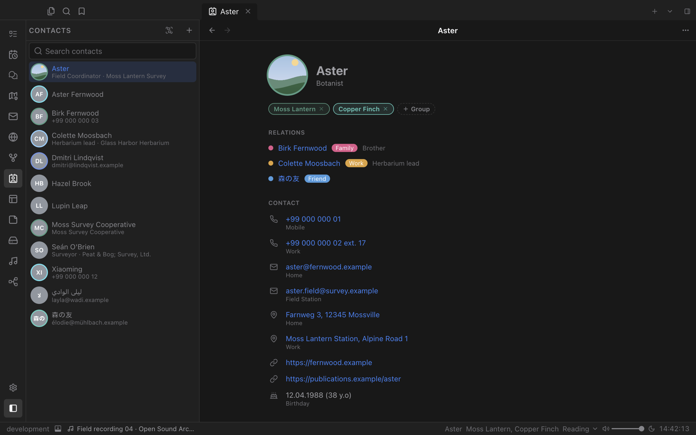
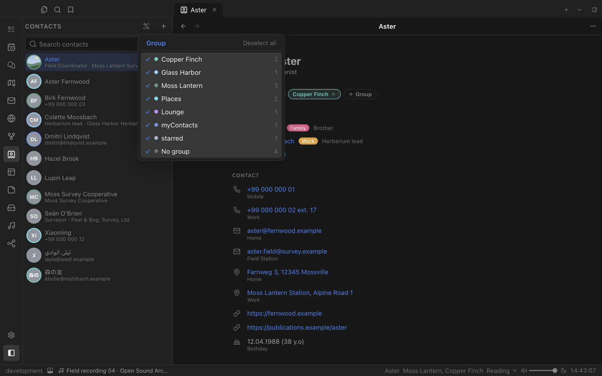

# Contacts

An address book made of plain vCard files in your vault. Rich contact cards with covers, coloured groups, typed relations and birthdays that show up in Calendar.

## Everything about a person

Each contact card brings together phone numbers, email addresses, postal addresses, websites, social profiles, organisation and role, a birthday with age, and Markdown notes. Phone numbers, emails, addresses and links are clickable.

- **Relations.** Link people as family, partner, friend, school, work and more. Relations stay intact when files are renamed.
- **Covers.** Give a contact a cover image from your vault.
- **Editing.** Press Command-E to switch between reading and a full structured editor.

## Groups with colours

Sort people into ordered, coloured groups and filter the sidebar by any combination of them.

## Open and connected

- Contacts are standard `.vcf` files. Cards exported from other address books (vCard 2.1, 3.0 and 4.0) open as they are, and unknown properties are kept.
- **Calendar** shows birthdays with the age someone turns.
- **Email** shows names and photos from your contacts.
- A relationship graph shows how everyone is connected.
